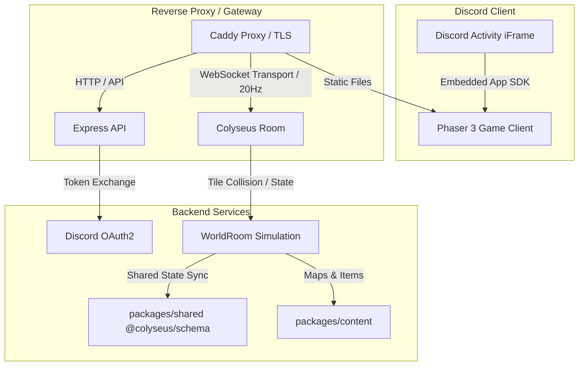

# RDO-RPG (Red Dead Online Discord Activity RPG)

A multiplayer Western RPG built specifically as a **Discord Activity** using **Phaser 3**, **Colyseus**, and **TypeScript** in a modern monorepo setup.

---

## 🎮 Architecture Overview



### Key Pillars

1. **Client (`apps/client`)**:
   - **Phaser 3 + Vite + TypeScript**: HD game engine optimized for low-latency canvas rendering inside the Discord desktop and mobile clients.
   - **Discord Embedded App SDK**: Handles user identity authentication, handshake, and context inside voice channel activities.
   - **Colyseus.js Client**: Connects to the multiplayer room, interpolating player movement and broadcasting input intents.

2. **Server (`apps/server`)**:
   - **Node.js + Colyseus + Express**: Authoritative multiplayer game server.
   - **20Hz Simulation Loop**: Runs deterministic world updates every 50ms (`setSimulationInterval`).
   - **Server-Side Tile Validation**: Validates all player movement and interactions against map collision layers and bounds to prevent cheating/clipping.
   - **Discord OAuth Token Exchange**: Secure `/api/token` route for exchanging authorization codes for Discord tokens.

3. **Shared Packages (`packages/shared` & `packages/content`)**:
   - **`@rdo-rpg/shared`**: Single source of truth for `@colyseus/schema` classes (`Player`, `WorldState`, `Stats`, `ItemStack`, `Position`), movement constants, and network message types.
   - **`@rdo-rpg/content`**: Static JSON data definitions for items, tilesets, and 2D tilemaps.

4. **Infrastructure (`infra`)**:
   - **Caddy Reverse Proxy**: Handles SSL termination and proxying for WebSocket (`/colyseus`), API (`/api`), and client static assets.
   - **Docker Compose**: Orchestrates multi-container local and production deployment.

---

## 📁 Repository Structure

```text
rdo-rpg/
├── apps/
│   ├── client/                  # Phaser 3 + Vite + TypeScript
│   │   ├── src/
│   │   │   ├── discord.ts       # Discord Embedded App SDK integration
│   │   │   ├── scenes/
│   │   │   │   └── WorldScene.ts# Tilemap rendering & player interpolation
│   │   │   └── main.ts          # Client bootstrap
│   │   ├── index.html
│   │   └── vite.config.ts
│   └── server/                  # Colyseus + Express + Node.js
│       ├── src/
│       │   ├── rooms/
│       │   │   └── WorldRoom.ts # 20Hz Colyseus Room with tile validation
│       │   ├── config.ts
│       │   └── index.ts         # Server entrypoint & HTTP routes
├── packages/
│   ├── shared/                  # Colyseus schemas & shared types
│   │   └── src/
│   │       ├── schema.ts        # Player, WorldState, Stats, ItemStack
│   │       ├── constants.ts     # 20Hz Tick rate, Directions, Action enums
│   │       ├── types.ts
│   │       └── index.ts
│   └── content/                 # Game data & tilemaps
│       ├── data/
│       │   ├── items.json       # Consumables, equipment, key items
│       │   ├── tilesets.json    # Tileset definitions & passability
│       │   └── maps/            # JSON grid maps with collision layers
│       └── src/
│           └── index.ts
├── infra/                       # Deployment configurations
│   ├── Caddyfile                # Discord Activity proxy configuration
│   ├── docker-compose.yml       # Caddy + Server + Client orchestration
│   ├── Dockerfile.server
│   └── Dockerfile.client
├── pnpm-workspace.yaml
├── package.json
└── tsconfig.base.json
```

---

## 🚀 Getting Started

### Prerequisites
- Node.js (v20+ recommended)
- pnpm (`corepack enable && corepack prepare pnpm@latest --activate`)
- Docker & Docker Compose (optional, for containerized run)

### Local Development

1. **Install dependencies:**
   ```bash
   pnpm install
   ```

2. **Build shared packages:**
   ```bash
   pnpm build:shared
   pnpm build:content
   ```

3. **Start development servers (Client + Server in parallel):**
   ```bash
   pnpm dev
   ```
   - Client will be running at `http://localhost:3000`
   - Server will be running at `http://localhost:2567`

### Discord Developer Portal Setup

1. Create an application on the [Discord Developer Portal](https://discord.com/developers/applications).
2. Under **Activities**, configure:
   - **URL Mappings**: Map `/` to your tunnel or production domain (e.g., via Cloudflare Tunnel).
3. Copy **Client ID** and **Client Secret** into your `.env`:
   ```env
   VITE_DISCORD_CLIENT_ID=your_client_id_here
   DISCORD_CLIENT_SECRET=your_client_secret_here
   ```

---

## 🐳 Docker Deployment

To launch the full stack with Caddy reverse proxy:

```bash
cd infra
docker compose up --build -d
```

---

## 📄 License
MIT
