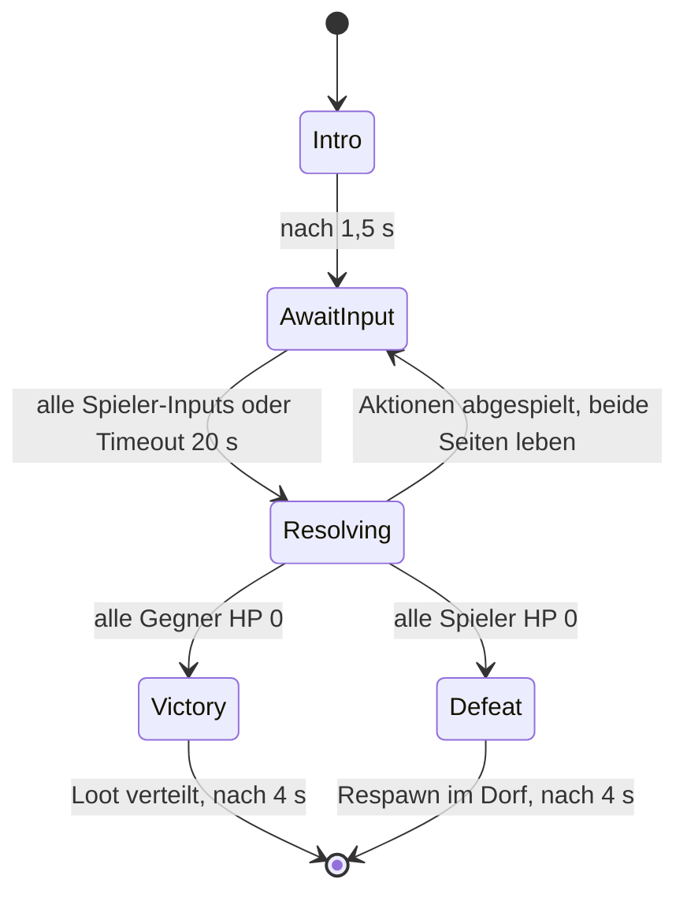

Hier ist der vollständige, zusammenhängende Text des gesamten Blueprints aus allen Abschnitten (von 1 bis 8):

---

# RDO-RPG: Discord Activity Multiplayer RPG — Blueprint

## 1. Tech Stack

| Layer | Choice | Rationale |
| --- | --- | --- |
| Client | Phaser 3.80 + TypeScript (strict) | Built-in tilemap/camera, HD canvas rendering, sub-pixel physics |
| Netcode | Colyseus 0.15 (`@colyseus/schema`) | Authoritative rooms, delta-encoded binary state, 20Hz patch rate |
| Discord | `@discord/embedded-app-sdk` | Activity iframe, RPC auth, voice-channel identity |
| Persistence | PostgreSQL 16 (Drizzle ORM) + Redis 7 | Durable profiles vs ephemeral zone/spatial state |
| Hosting | Fly.io / Railway — single region per shard; WSS behind Discord URL-mapping proxy | Activities require all traffic through `/.proxy/` mapped paths |
| Audio | Web Audio API + ambient western soundtrack and sound effects | Atmospheric Western audio immersion |

**Protocol:** Colyseus binary schema patches (server→client @ 20Hz), client inputs as sequenced command messages (client→server @ 20Hz, input buffer with seq numbers for reconciliation). No client authority over position/HP/inventory — ever.

**Rendering:** High-Definition Western Canvas (1920×1080 viewport / 1376×768 world coordinates), smooth sub-pixel continuous movement, 16×16 fine collision sub-grid and cinematic lighting.

---

## 2. Discord Activity Auth Flow

```
┌────────────────┐      ┌──────────────────┐      ┌─────────────┐      ┌──────────┐
│ Discord Client │      │ Activity iframe  │      │ Game Server │      │ Discord  │
│                │      │ (your client JS) │      │ (Node)      │      │ API      │
└───────┬────────┘      └────────┬─────────┘      └──────┬──────┘      └────┬─────┘
        │  launch Activity       │                       │                  │
        │───────────────────────>│                       │                  │
        │                        │ sdk.ready()           │                  │
        │                        │ sdk.commands.authorize│                  │
        │<───────────────────────│  ({scope:[identify,   │                  │
        │  consent UI            │   guilds, rpc.voice.read]})              │
        │  returns `code`        │                       │                  │
        │───────────────────────>│                       │                  │
        │                        │ POST /.proxy/api/token {code}            │
        │                        │──────────────────────>│                  │
        │                        │                       │ POST /oauth2/token
        │                        │                       │ (code+client_secret)
        │                        │                       │─────────────────>│
        │                        │                       │<─ access_token ──│
        │                        │                       │ GET /users/@me   │
        │                        │                       │─────────────────>│
        │                        │                       │<─ user object ───│
        │                        │                       │ upsert player row (Postgres)
        │                        │                       │ sign JWT {uid, guildId,
        │                        │<── {access_token, ────│  channelId, exp: 4h}
        │                        │     session_jwt}      │                  │
        │                        │ sdk.commands.authenticate({access_token})│
        │                        │ colyseus.joinOrCreate("zone",            │
        │                        │   {jwt: session_jwt}) │                  │
        │                        │──────── WSS ─────────>│ verify JWT in onAuth()

```

Key points:

* All HTTP/WSS endpoints registered in Discord Dev Portal **URL Mappings** (`/api` → `api.yourgame.io`, `/colyseus` → `ws.yourgame.io`). Client always fetches via `/.proxy/` prefix.
* JWT claims: `{ discordId, guildId, voiceChannelId, iat, exp }`. `guildId` → posse key; `voiceChannelId` → fireteam room affinity (players in same VC are routed to the same Colyseus room via matchmaking filter on Redis).
* Refresh: silent re-auth via SDK before JWT expiry; Colyseus `onAuth` rejects expired tokens → client re-handshakes without dropping the iframe.

---

## 3. Authoritative State Schema

```ts
// schema.ts — @colyseus/schema
import { Schema, MapSchema, ArraySchema, type } from "@colyseus/schema";

export class Vec2 extends Schema {
  @type("int16") x = 0;
  @type("int16") y = 0;
}

export class Horse extends Schema {
  @type("int16") x = 0;
  @type("int16") y = 0;
  @type("uint8") stamina = 100;        // drains on gallop, regens idle
  @type("uint8") tier = 1;             // speed multiplier source
  @type("boolean") hitched = true;
  @type({ map: "uint16" }) saddlebag = new MapSchema<number>(); // itemId -> qty
}

export class Player extends Schema {
  @type("string") discordId = "";
  @type("string") name = "";
  @type("int16") x = 0;
  @type("int16") y = 0;
  @type("uint8") dir = 0;              // 0=S 1=N 2=W 3=E (4-dir facing)
  @type("uint8") hp = 100;
  @type("uint8") state = 0;            // 0 idle, 1 walk, 2 mounted, 3 lassoed, 4 deadeye, 5 dead
  @type("boolean") mounted = false;
  @type(Horse) horse = new Horse();
  @type("uint8") deadEyeCharge = 0;    // 0..100
  @type("boolean") deadEyeActive = false;
  @type("int16") honor = 0;            // -100..100
  @type("uint16") bounty = 0;          // $, >0 = wanted
  @type("string") posseId = "";        // == guildId
  @type("uint8") wantedLevel = 0;      // drives lawmen wave index
  @type("int32") lastInputSeq = 0;
  @type({ map: "uint16" }) inventory = new MapSchema<number>();
}

export class WorldEntity extends Schema {
  @type("string") id = "";
  @type("uint8") kind = 0;             // 0 animal, 1 lawman, 2 npc, 3 pelt, 4 moonshine, 5 lassoRope
  @type("uint8") subtype = 0;          // animal species / lawman tier
  @type("int16") x = 0;
  @type("int16") y = 0;
  @type("uint8") hp = 10;
  @type("uint8") aiState = 0;          // 0 idle, 1 wander, 2 flee, 3 pursue, 4 attack, 5 downed
  @type("string") targetId = "";       // pursue/lasso target
  @type("uint8") peltQuality = 3;      // 3 pristine → degrades on bad hits
  @type("boolean") lassoed = false;
}

export class CampState extends Schema {
  @type("string") posseId = "";
  @type("int16") x = 0;
  @type("int16") y = 0;
  @type("uint8") level = 1;            // unlocks fast travel(2), crafting(3)
  @type("uint16") supplies = 0;
  @type("boolean") underAttack = false;
}

export class BountyContract extends Schema {
  @type("string") targetDiscordId = "";
  @type("uint16") amount = 0;
  @type("string") issuerPosseId = "";
  @type("int32") expiresAtTick = 0;
}

export class LawState extends Schema {
  @type("uint8") waveIndex = 0;        // 0 none → 4 marshal posse
  @type("int32") nextWaveTick = 0;
  @type("string") focusPlayerId = "";
}

export class ZoneState extends Schema {
  @type("uint32") tick = 0;
  @type({ map: Player }) players = new MapSchema<Player>();
  @type({ map: WorldEntity }) entities = new MapSchema<WorldEntity>();
  @type({ map: CampState }) camps = new MapSchema<CampState>();
  @type([BountyContract]) bounties = new ArraySchema<BountyContract>();
  @type(LawState) law = new LawState();
}

```

Postgres (durable, written on room leave + 60s autosave): `players(discord_id pk, honor, cash, inventory jsonb, horse jsonb)`, `posses(guild_id pk, camp_level, supplies, camp_pos)`, `bounty_ledger`. Redis: `zone:{id}:spatial` (grid-cell → entity-id sets, 64px cells), `vc:{channelId}:room` (fireteam routing), `bounty:pings` pub/sub channel → fans out server-wide ping to all rooms of rival posses.

---

## 4. Functional TypeScript Boilerplate

### 4a. Server tick + movement validation (anti-teleport/speed check)

```ts
// ZoneRoom.ts
import { Room, Client } from "colyseus";
import { ZoneState, Player } from "./schema";

const TICK_MS = 50;                       // 20Hz
const TILE = 16;
const BASE_SPEED = 1.5;                   // px/tick walking
const MOUNT_SPEED = 3.0;
const SPEED_SLOP = 1.15;                  // 15% tolerance for jitter

interface InputMsg { seq: number; dx: -1|0|1; dy: -1|0|1; dt: number }

export class ZoneRoom extends Room<ZoneState> {
  private inputs = new Map<string, InputMsg[]>();
  private lastPos = new Map<string, { x: number; y: number; t: number }>();

  onCreate() {
    this.setState(new ZoneState());
    this.setPatchRate(TICK_MS);
    this.onMessage("input", (c, m: InputMsg) => {
      const q = this.inputs.get(c.sessionId) ?? [];
      if (q.length < 8) q.push(m);        // cap buffer: drop floods
      this.inputs.set(c.sessionId, q);
    });
    this.setSimulationInterval(() => this.tick(), TICK_MS);
  }

  async onAuth(_c: Client, opts: { jwt: string }) {
    return verifyJwt(opts.jwt);           // throws → rejected
  }

  onJoin(client: Client, _o: unknown, auth: JwtClaims) {
    const p = new Player();
    p.discordId = auth.discordId;
    p.posseId = auth.guildId;
    loadFromPostgres(p, auth.discordId);  // async hydrate
    this.state.players.set(client.sessionId, p);
  }

  private tick() {
    this.state.tick++;
    this.state.players.forEach((p, sid) => {
      const q = this.inputs.get(sid);
      if (!q?.length) return;
      const input = q.shift()!;

      if (p.state === 3 /* lassoed */ || p.state === 5 /* dead */) {
        p.lastInputSeq = input.seq;       // ack but ignore
        return;
      }

      const speed = p.mounted ? MOUNT_SPEED : BASE_SPEED;
      const maxSpeed = speed * SPEED_SLOP;
      const nx = p.x + input.dx * speed;
      const ny = p.y + input.dy * speed;

      // Anti-teleport: compare against last authoritative pos, not client claim.
      const last = this.lastPos.get(sid) ?? { x: p.x, y: p.y, t: this.state.tick };
      const elapsed = Math.max(1, this.state.tick - last.t);
      const dist = Math.hypot(nx - last.x, ny - last.y);
      if (dist > maxSpeed * elapsed) {
        p.lastInputSeq = input.seq;       // reject: snap, force reconciliation
        return;
      }

      // Tile collision (server-side collision map, 16px grid).
      if (!this.collides(nx, ny, p.mounted)) { p.x = nx; p.y = ny; }
      if (input.dx || input.dy) p.dir = dirOf(input.dx, input.dy);

      // Horse stamina
      if (p.mounted) {
        p.horse.x = p.x; p.horse.y = p.y;
        p.horse.stamina = Math.max(0, p.horse.stamina - ((input.dx || input.dy) ? 1 : 0));
        if (p.horse.stamina === 0) { p.mounted = false; p.state = 1; } // bucked
      } else if (this.state.tick % 10 === 0) {
        p.horse.stamina = Math.min(100, p.horse.stamina + 1);
      }

      p.lastInputSeq = input.seq;
      this.lastPos.set(sid, { x: p.x, y: p.y, t: this.state.tick });
      updateSpatialGrid(sid, p.x, p.y);   // Redis / in-memory grid, 64px cells
    });

    this.tickLawmen();
    this.tickEntities();
  }

  private collides(x: number, y: number, mounted: boolean): boolean {
    const w = mounted ? 16 : 12, h = mounted ? 24 : 12;
    return aabbVsCollisionMap(x, y, w, h, this.collisionMap, TILE);
  }
}

```

### 4b. Dead Eye combat handler (paint + hit verification)

```ts
// combat.ts — registered in ZoneRoom.onCreate
const DEADEYE_DURATION_TICKS = 60;        // 3s
const MAX_PAINTS = 6;
const WEAPON = { revolver: { dmg: 34, range: 96, tier: 1 },
                 rifle:    { dmg: 50, range: 160, tier: 2 } } as const;

interface DeadEyeSession { paints: { targetId: string; paintTick: number }[]; endsAt: number }
const deadEyeSessions = new Map<string, DeadEyeSession>();

export function registerCombat(room: ZoneRoom) {
  room.onMessage("deadeye:activate", (c) => {
    const p = room.state.players.get(c.sessionId)!;
    if (p.deadEyeCharge < 25 || p.deadEyeActive) return;
    p.deadEyeActive = true; p.state = 4;
    deadEyeSessions.set(c.sessionId, { paints: [], endsAt: room.state.tick + DEADEYE_DURATION_TICKS });
  });

  room.onMessage("deadeye:paint", (c, m: { targetId: string }) => {
    const p = room.state.players.get(c.sessionId)!;
    const s = deadEyeSessions.get(c.sessionId);
    if (!p.deadEyeActive || !s || s.paints.length >= MAX_PAINTS) return;
    const t = resolveTarget(room, m.targetId);
    if (!t) return;
    const tp = rewindPosition(m.targetId, 2);
    if (dist(p, tp) > WEAPON.revolver.range || !lineOfSight(p, tp, room.collisionMap)) return;
    s.paints.push({ targetId: m.targetId, paintTick: room.state.tick });
  });

  room.onMessage("deadeye:fire", (c) => {
    const p = room.state.players.get(c.sessionId)!;
    const s = deadEyeSessions.get(c.sessionId);
    if (!p.deadEyeActive || !s) return;
    for (const paint of s.paints) {
      const t = resolveTarget(room, paint.targetId);
      if (!t || t.hp <= 0) continue;
      const tp = rewindPosition(paint.targetId, estimateClientLagTicks(c));
      if (dist(p, tp) > WEAPON.revolver.range * 1.1) continue;
      applyDamage(room, c.sessionId, paint.targetId, WEAPON.revolver.dmg, {
        guaranteedHeadshot: true,
      });
    }
    endDeadEye(room, c.sessionId, p, s);
  });

  room.onMessage("fire", (c, m: { aimDir: number }) => {
    const p = room.state.players.get(c.sessionId)!;
    if (p.state >= 3) return;
    const hit = raycastSpatial(p.x, p.y, m.aimDir, WEAPON.revolver.range, room, c);
    if (hit) applyDamage(room, c.sessionId, hit.id, WEAPON.revolver.dmg, { guaranteedHeadshot: false });
  });
}

function applyDamage(room: ZoneRoom, attackerSid: string, targetId: string,
                     dmg: number, opts: { guaranteedHeadshot: boolean }) {
  const a = room.state.players.get(attackerSid)!;
  const t = resolveTarget(room, targetId);
  if (!t) return;
  t.hp = Math.max(0, t.hp - dmg);
  if (t.hp === 0) {
    a.deadEyeCharge = Math.min(100, a.deadEyeCharge + 15);
    if (isAnimal(t)) t.peltQuality = opts.guaranteedHeadshot ? t.peltQuality : t.peltQuality - 1;
    if (isPlayer(targetId, room)) {
      a.honor -= 10;
      a.bounty += 25;
      a.wantedLevel = bountyToWave(a.bounty);
      room.state.law.focusPlayerId = attackerSid;
      publishBountyPing(a);
    }
    if (isLawman(t)) { a.honor -= 5; a.bounty += 50; escalateWave(room); }
  }
  room.broadcast("fx:hit", { targetId, dmg }, { afterNextPatch: true });
}

function endDeadEye(room: ZoneRoom, sid: string, p: Player, s: DeadEyeSession) {
  p.deadEyeActive = false; p.state = 0;
  p.deadEyeCharge = Math.max(0, p.deadEyeCharge - 25 - s.paints.length * 5);
  deadEyeSessions.delete(sid);
}

```

### 4c. Client bootstrap (Phaser + Discord SDK + reconciliation)

```ts
// main.ts
import { DiscordSDK } from "@discord/embedded-app-sdk";
import { Client as Colyseus } from "colyseus.js";
import Phaser from "phaser";

const sdk = new DiscordSDK(import.meta.env.VITE_DISCORD_CLIENT_ID);

async function boot() {
  await sdk.ready();
  const { code } = await sdk.commands.authorize({
    client_id: import.meta.env.VITE_DISCORD_CLIENT_ID,
    response_type: "code", scope: ["identify", "guilds", "rpc.voice.read"], prompt: "none",
  });
  const { access_token, session_jwt } = await fetch("/.proxy/api/token", {
    method: "POST", body: JSON.stringify({ code }), headers: { "Content-Type": "application/json" },
  }).then(r => r.json());
  await sdk.commands.authenticate({ access_token });

  const net = new Colyseus(`wss://${location.host}/.proxy/colyseus`);
  const room = await net.joinOrCreate("zone", { jwt: session_jwt });

  new Phaser.Game({
    type: Phaser.WEBGL, width: 256, height: 240,
    pixelArt: true, roundPixels: true,
    scale: { mode: Phaser.Scale.NONE, zoom: Math.max(1, Math.floor(Math.min(innerWidth / 256, innerHeight / 240))) },
    scene: [new ZoneScene(room)],
  });
}
boot();

```

---

## 5. System Specs (RDO Mechanics)

* **Lasso:** projectile entity (8px/tick, 64px max). On hit: target `state=3`, position lerped toward roper at 0.5px/tick server-side, breaks on roper damage or 5s timer. Lassoed players mash (send `struggle` msgs; 10 reduces timer by 1s).
* **Honor:** ±events table (kill NPC −10, lawman −5, clean hunt +2, delivery +5, bounty capture alive +15/dead +5). Honor gates shop prices (±10%) and mission pool.
* **Lawmen waves (state machine):** `wantedLevel` 1men (pursue/attack FSM), 2→+2 riflemen (keep 96px range), 3→mounted marshals (lasso-capable), 4→posse of 6 + camp-raid trigger. Wave spawns at map-edge spawn points every `nextWaveTick` (200 ticks) until bounty paid at a telegraph-office tile or player dies (bounty halves).
* **Camp:** one `CampState` per guildId, placed by posse leader. Level 1 respawn point; L2 fast-travel (teleport between camp + visited towns, 10 supplies); L3 crafting (pelts+herbs → tonics that grant Dead Eye charge). Resupply defense: periodic `underAttack=true` event spawns raider wave; failure drains supplies.
* **Hunting:** animals FSM idle/wander/flee (flee triggers on player within 48px unless crouched). Pelt quality: pristine requires weapon tier ≤ animal size class AND hit on the 4px head sub-hitbox (or Dead Eye). Pelt → carry on horse saddlebag (max 2) → butcher NPC pays `basePrice × quality`.
* **Moonshine events:** timed delivery — pick up crate entity, movement −25%, cross 2–3 grid zones to drop point; crate drops on death and is stealable → natural PvP flashpoint, pinged to the zone.

---

## 6. Phase 1 – Implementierungsvertiefung: „Walking Skeleton“

Ziel von Phase 1 ist ein durchgängig lauffähiger Vertikalschnitt: Ein Spieler startet die Activity im Discord-Voice-Channel, wird authentifiziert, erscheint auf einer Tilemap, bewegt sich, sieht andere Spieler desselben Channels in Echtzeit und sein Fortschritt (Position, Name, Gold) überlebt einen Reload. Keine Kämpfe, keine Quests – nur das Fundament, auf dem alles Weitere aufbaut.

### 6.1 Repository-Struktur (Monorepo)

```
rdo-rpg/
├── apps/
│   ├── client/          # Vite + TypeScript + Phaser 3
│   └── server/          # Node 20 + Colyseus + Express
├── packages/
│   ├── shared/          # Schemas, Konstanten, Message-Typen
│   └── content/         # Tilemaps (Tiled JSON), Sprites, Item-Defs
├── infra/
│   ├── docker-compose.yml
│   └── Caddyfile        # Reverse-Proxy für Discord URL-Mapping
├── .env.example
└── pnpm-workspace.yaml

```

Das Paket `shared` ist entscheidend: Client und Server importieren dieselben `@colyseus/schema`-Klassen und Message-Enums, sodass Protokolländerungen zur Compile-Zeit auffallen.

### 6.2 Discord-Activity-Bootstrap

**Developer-Portal-Konfiguration**

| Einstellung | Wert für Phase 1 |
| --- | --- |
| Activity aktiviert | Ja (Embedded App) |
| OAuth2 Redirect | `https://<app-id>.discordsays.com` |
| Scopes | `identify`, `guilds`, `rpc.activities.write` |
| URL Mapping `/` | `<tunnel-url>` (Client) |
| URL Mapping `/api` | `<tunnel-url>/api` (Server REST) |
| URL Mapping `/ws` | `<tunnel-url>/ws` (Colyseus) |

**Client-Initialisierung**

```ts
// apps/client/src/discord.ts
import { DiscordSDK } from "@discord/embedded-app-sdk";

export async function initDiscord() {
  const sdk = new DiscordSDK(import.meta.env.VITE_DISCORD_CLIENT_ID);
  await sdk.ready();

  const { code } = await sdk.commands.authorize({
    client_id: import.meta.env.VITE_DISCORD_CLIENT_ID,
    response_type: "code",
    state: "",
    prompt: "none",
    scope: ["identify", "guilds", "rpc.activities.write"],
  });

  const res = await fetch("/api/auth/token", {
    method: "POST",
    headers: { "Content-Type": "application/json" },
    body: JSON.stringify({ code }),
  });
  const { access_token, session_token } = await res.json();

  await sdk.commands.authenticate({ access_token });

  return {
    sdk,
    sessionToken: session_token,          // unser eigenes JWT für Colyseus
    instanceId: sdk.instanceId,           // = eine Activity-Instanz pro Voice-Channel
    channelId: sdk.channelId,
    guildId: sdk.guildId,
  };
}

```

**Server: Token-Exchange**

```ts
// apps/server/src/routes/auth.ts
router.post("/token", async (req, res) => {
  const body = new URLSearchParams({
    client_id: process.env.DISCORD_CLIENT_ID!,
    client_secret: process.env.DISCORD_CLIENT_SECRET!,
    grant_type: "authorization_code",
    code: req.body.code,
  });

  const tokenRes = await fetch("https://discord.com/api/oauth2/token", {
    method: "POST",
    headers: { "Content-Type": "application/x-www-form-urlencoded" },
    body,
  });
  if (!tokenRes.ok) return res.status(401).json({ error: "oauth_failed" });
  const { access_token } = await tokenRes.json();

  const user = await fetch("https://discord.com/api/users/@me", {
    headers: { Authorization: `Bearer ${access_token}` },
  }).then(r => r.json());

  const session_token = signJwt({ sub: user.id, name: user.global_name ?? user.username }, "12h");
  res.json({ access_token, session_token });
});

```

### 6.3 Room-Modell: Eine Activity-Instanz = ein Room

Colyseus-Rooms werden über die `instanceId` von Discord adressiert. Alle Spieler im selben Voice-Channel landen damit automatisch in derselben Welt-Instanz.

```ts
// apps/server/src/rooms/WorldRoom.ts
export class WorldRoom extends Room<WorldState> {
  maxClients = 16;

  onCreate(options: { instanceId: string }) {
    this.setState(new WorldState());
    this.setPatchRate(50);          // 20 Hz State-Diffs
    this.setSimulationInterval(dt => this.tick(dt), 1000 / 20);

    this.onMessage(Msg.Input, (client, input: InputPayload) => {
      this.inputQueue.set(client.sessionId, input);
    });
    this.onMessage(Msg.Chat, (client, text: string) => {
      this.broadcast(Msg.Chat, { from: client.sessionId, text: text.slice(0, 200) });
    });
  }

  async onAuth(client: Client, options: { token: string }) {
    const claims = verifyJwt(options.token);
    return claims;
  }

  async onJoin(client: Client) {
    const save = await repo.loadOrCreate(client.auth.sub, client.auth.name);
    const p = new Player();
    p.discordId = client.auth.sub;
    p.name = save.name;
    p.x = save.x; p.y = save.y;
    p.gold = save.gold;
    this.state.players.set(client.sessionId, p);
  }

  async onLeave(client: Client, consented: boolean) {
    const p = this.state.players.get(client.sessionId);
    if (p) await repo.save(p);
    this.state.players.delete(client.sessionId);
  }
}

```

### 6.4 Shared State-Schema

```ts
// packages/shared/src/schema.ts
import { Schema, MapSchema, type } from "@colyseus/schema";

export class Player extends Schema {
  @type("string") discordId = "";
  @type("string") name = "";
  @type("number") x = 0;
  @type("number") y = 0;
  @type("uint8")  dir = 0;        // 0=S 1=W 2=E 3=N
  @type("boolean") moving = false;
  @type("uint32") gold = 0;
}

export class WorldState extends Schema {
  @type({ map: Player }) players = new MapSchema<Player>();
  @type("string") mapId = "frontier_town";
}

```

### 6.5 Bewegung: Server-autoritativ mit Client-Prediction

Bewegung erfolgt **tile-basiert** (16×16 px), nicht in freien Pixeln.

```mermaid
sequenceDiagram
    participant C as Client
    participant S as Server
    C->>C: Taste gedrückt → lokal Tile-Move starten (Prediction)
    C->>S: Input {seq, dir}
    S->>S: Kollision gegen Tilemap prüfen
    S-->>C: State-Patch {x, y, lastSeq}
    C->>C: lastSeq vergleichen; bei Abweichung snappen

```

**Server-Tick**

```ts
tick(dt: number) {
  for (const [sid, input] of this.inputQueue) {
    const p = this.state.players.get(sid);
    if (!p || p.moving) continue;

    const [dx, dy] = DIR_VECTORS[input.dir];
    const tx = p.x + dx, ty = p.y + dy;
    p.dir = input.dir;

    if (this.map.isWalkable(tx, ty) && !this.isOccupied(tx, ty)) {
      p.x = tx; p.y = ty;
    }
    p.lastSeq = input.seq;
  }
  this.inputQueue.clear();
}

```

### 6.6 Client-Rendering (Phaser 3)

| Szene | Verantwortung |
| --- | --- |
| `BootScene` | Discord-Init, Asset-Preload, Colyseus-Connect, Übergabe an WorldScene |
| `WorldScene` | Tilemap rendern, Spieler-Sprites synchron halten, Input, Kamera, Chat-Overlay |

```ts
// apps/client/src/scenes/WorldScene.ts (Auszug)
create() {
  const map = this.make.tilemap({ key: "frontier_town" });
  const tiles = map.addTilesetImage("rdo_tiles", "tiles");
  map.createLayer("ground", tiles);
  map.createLayer("decor", tiles);

  this.room.state.players.onAdd((p, sid) => {
    const sprite = this.add.sprite(p.x * 16, p.y * 16, "hero").setOrigin(0);
    const label = this.add.bitmapText(0, -10, "western_font", p.name, 8);
    this.sprites.set(sid, { sprite, label });

    p.onChange(() => {
      const s = this.sprites.get(sid)!;
      this.tweens.add({ targets: s.sprite, x: p.x * 16, y: p.y * 16, duration: 120 });
      s.sprite.play(`walk_${p.dir}`, true);
    });

    if (sid === this.room.sessionId) this.cameras.main.startFollow(sprite);
  });

  this.room.state.players.onRemove((_, sid) => {
    this.sprites.get(sid)?.sprite.destroy();
    this.sprites.delete(sid);
  });
}

```

### 6.7 Persistenz

```prisma
model Character {
  discordId String   @id
  name      String
  x         Int      @default(10)
  y         Int      @default(12)
  gold      Int      @default(0)
  mapId     String   @default("frontier_town")
  updatedAt DateTime @updatedAt
}

```

### 6.8 Lokale Entwicklungsumgebung

1. `pnpm install` und `.env` aus `.env.example` befüllen.
2. `pnpm dev` startet Client (5173) und Server (2567).
3. Tunnel öffnen: `cloudflared tunnel --url http://localhost:8080`.
4. Tunnel-URL in die URL-Mappings des Discord Developer Portals eintragen.
5. In Discord Voice-Channel beitreten und Activity starten.

```
:8080 {
  handle /api/* { reverse_proxy localhost:2567 }
  handle /ws*   { reverse_proxy localhost:2567 }
  handle        { reverse_proxy localhost:5173 }
}

```

### 6.9 Abnahmekriterien Phase 1

* [ ] Activity startet aus einem Voice-Channel in unter 5 Sekunden bis zum ersten Frame.
* [ ] Zwei Discord-Accounts im selben Channel sehen sich gegenseitig innerhalb von 200 ms Latenz bewegen.
* [ ] Spieler in unterschiedlichen Voice-Channels landen in getrennten Rooms.
* [ ] Reload des iframes stellt Position und Gold wieder her.
* [ ] Kollision mit Wänden/Objekten der Tilemap funktioniert serverseitig.
* [ ] Chat-Nachrichten erscheinen bei allen Spielern des Rooms.
* [ ] Ungültiges oder abgelaufenes JWT führt zu einem sauberen Fehler statt zu einem Hänger.

### 6.10 Risiken Phase 1

| Risiko | Auswirkung | Gegenmaßnahme |
| --- | --- | --- |
| Discord-CSP blockiert Asset-Loads | Schwarzer Bildschirm | Alle Assets selbst hosten, keine CDNs |
| Mobile Discord hat anderes Viewport-Verhalten | Abgeschnittene UI | Früh auf iOS/Android testen, Safe-Area via `sdk.commands.getPlatformBehaviors` |
| Room stirbt bei Server-Neustart | Spieler fliegen raus | Colyseus-Reconnect-Token (`allowReconnection`, 30 s) + Autosave |
| Tile-Bewegung fühlt sich träge an | Schlechte Haptik | Input-Buffering: nächsten Richtungsinput während laufendem Step vormerken |
| Instanz wird zu groß (>16 Spieler) | Lag | Harte Grenze + Hinweistext; Sharding erst in Phase 3 |

---

## 7. Phase 2 – Kampf- und Questsystem

### 7.1 Schema-Erweiterung: Stats, Inventar, Quest-Fortschritt

```ts
// packages/shared/src/schema.ts (Ergänzungen)
export class Stats extends Schema {
  @type("uint8")  level = 1;
  @type("uint32") xp = 0;
  @type("uint16") hp = 20;
  @type("uint16") maxHp = 20;
  @type("uint8")  atk = 4;
  @type("uint8")  def = 2;
  @type("uint8")  spd = 3;
}

export class ItemStack extends Schema {
  @type("string") itemId = "";     // Referenz auf content/items.json
  @type("uint8")  qty = 1;
}

export class QuestProgress extends Schema {
  @type("string") questId = "";
  @type("string") stepId = "";
  @type({ map: "uint16" }) counters = new MapSchema<number>();
}

export class Player extends Schema {
  // ... Felder aus Phase 1 ...
  @type(Stats) stats = new Stats();
  @type([ItemStack]) inventory = new ArraySchema<ItemStack>();
  @type({ map: QuestProgress }) quests = new MapSchema<QuestProgress>();
  @type("string") encounterId = "";  // "" = frei in der Welt
}

```

### 7.2 Encounter-Architektur

```ts
export class Combatant extends Schema {
  @type("string") id = "";          // sessionId oder "npc:<uid>"
  @type("string") spriteKey = "";
  @type("uint16") hp = 0;
  @type("uint16") maxHp = 0;
  @type("boolean") isEnemy = false;
  @type("boolean") defending = false;
}

export class Encounter extends Schema {
  @type("string") id = "";
  @type("uint16") tileX = 0;
  @type("uint16") tileY = 0;
  @type([Combatant]) combatants = new ArraySchema<Combatant>();
  @type(["string"]) turnOrder = new ArraySchema<string>();
  @type("uint8")  turnIndex = 0;
  @type("uint8")  phase = 0;        // 0=Intro 1=AwaitInput 2=Resolving 3=Victory 4=Defeat
  @type("uint32") phaseEndsAt = 0;  // Server-Timestamp für Timeout
  @type(["string"]) log = new ArraySchema<string>();
}

export class WorldState extends Schema {
  @type({ map: Player }) players = new MapSchema<Player>();
  @type({ map: Encounter }) encounters = new MapSchema<Encounter>();
  @type("string") mapId = "frontier_town";
}

```

### 7.3 Kampfablauf als Zustandsautomat



**Resolver**

```ts
// apps/server/src/combat/resolve.ts
export function resolveRound(enc: Encounter, actions: Map<string, CombatActionPayload>, rng: Rng) {
  for (const c of enc.combatants) {
    if (c.isEnemy && c.hp > 0) actions.set(c.id, enemyAI(c, enc, rng));
  }
  for (const c of enc.combatants) {
    if (!c.isEnemy && c.hp > 0 && !actions.has(c.id)) actions.set(c.id, { kind: "defend" });
  }

  const order = [...enc.combatants]
    .filter(c => c.hp > 0)
    .sort((a, b) => statsOf(b).spd - statsOf(a).spd || rng.next() - 0.5);

  const events: CombatEvent[] = [];
  for (const actor of order) {
    if (actor.hp === 0) continue;
    const action = actions.get(actor.id)!;
    switch (action.kind) {
      case "defend":
        actor.defending = true;
        events.push({ type: "defend", actor: actor.id });
        break;
      case "attack": {
        const target = pickTarget(enc, action.targetId, actor.isEnemy);
        if (!target) break;
        const dmg = calcDamage(statsOf(actor), statsOf(target), target.defending, rng);
        target.hp = Math.max(0, target.hp - dmg);
        events.push({ type: "hit", actor: actor.id, target: target.id, dmg, crit: dmg.crit });
        break;
      }
      case "item":  events.push(...applyItem(actor, action, enc)); break;
      case "flee":  events.push(tryFlee(actor, enc, rng)); break;
    }
  }
  for (const c of enc.combatants) c.defending = false;
  return events;
}

```

Schadensformel:


$$\text{dmg} = \max\!\left(1,\ \left\lfloor \text{atk} \cdot r - \frac{\text{def}}{2} \right\rfloor\right), \quad r \in [0.85,\ 1.15]$$

### 7.4 Gegner-Definitionen und KI

| Profil | Verhalten |
| --- | --- |
| `aggressive` | Greift immer den Spieler mit den wenigsten HP an |
| `tactical` | Verteidigt bei HP < 30 %, sonst Angriff auf das Ziel mit der niedrigsten `def` |
| `cowardly` | Flieht bei HP < 50 %, sonst zufälliges Ziel |

### 7.5 Belohnungsverteilung

* **XP:** Voll für jeden Teilnehmer, der mindestens eine Aktion ausgeführt hat.
* **Gold:** Würfel aus dem Bereich der Gegner-Definition (eigener Wurf pro Spieler).
* **Drops:** Jeder Spieler würfelt separat gegen die `chance`.
* **Level-Up-Kurve:** $\text{xp}_{\text{next}} = 10 \cdot \text{level}^2$.

### 7.6 NPC-Dialoge als Graphen

```json
// packages/content/dialogs/sheriff.json
{
  "id": "sheriff",
  "start": "greet",
  "nodes": {
    "greet": {
      "text": "Howdy, Fremder. Die Kojoten machen den Farmern das Leben schwer.",
      "choices": [
        { "text": "Ich kümmere mich darum.", "next": "accept", "if": { "questNot": "coyote_cull" } },
        { "text": "Wie läuft's?", "next": "progress", "if": { "questStep": ["coyote_cull", "hunt"] } },
        { "text": "Hier sind die Felle.", "next": "turnin", "if": { "counterGte": ["coyote_cull", "coyote_killed", 5] } },
        { "text": "Bis dann.", "next": null }
      ]
    },
    "accept": {
      "text": "Erledige fünf von den Biestern. Ich zahle 30 Gold.",
      "effects": [{ "startQuest": "coyote_cull" }],
      "next": null
    },
    "progress": {
      "text": "Noch nicht fertig? Die Viecher warten nicht.",
      "next": null
    },
    "turnin": {
      "text": "Gute Arbeit. Hier, wie versprochen.",
      "effects": [{ "completeQuest": "coyote_cull" }, { "gold": 30 }, { "xp": 40 }],
      "next": null
    }
  }
}

```

### 7.7 Quest-Definitionen

```json
// packages/content/quests.json
{
  "coyote_cull": {
    "title": "Kojotenplage",
    "steps": {
      "hunt":   { "desc": "Erlege 5 Kojoten.", "track": { "counter": "coyote_killed", "target": 5 } },
      "return": { "desc": "Kehre zum Sheriff zurück." }
    },
    "order": ["hunt", "return"],
    "autoAdvance": true
  }
}

```

### 7.8 Client: Szenen

| Szene | Verantwortung |
| --- | --- |
| `CombatScene` | Rendert Kampfhintergrund, Combatants, Menü, Countdown, Kampf-Log |
| `DialogScene` | Textbox im Western-Stil mit Typewriter-Effekt, Choice-Cursor |

### 7.9 Persistenz-Erweiterung

```prisma
model Character {
  discordId  String   @id
  name       String
  x          Int      @default(10)
  y          Int      @default(12)
  gold       Int      @default(0)
  mapId      String   @default("frontier_town")
  level      Int      @default(1)
  xp         Int      @default(0)
  hp         Int      @default(20)
  statsJson  String   @default("{}")
  inventory  Json     @default("[]")
  quests     Json     @default("{}")
  updatedAt  DateTime @updatedAt
}

```

### 7.10 Abnahmekriterien Phase 2

* [ ] Zufalls-Encounter löst in markierten Zonen aus; außerhalb nie.
* [ ] Zweiter Spieler, der an ein laufendes Encounter heranläuft, tritt bei.
* [ ] Alle Spieler eines Encounters sehen identische Kampf-Events.
* [ ] Timeout von 20 s erzwingt Rundenauflösung.
* [ ] Manipulierte `CombatAction`-Nachrichten werden verworfen und geloggt.
* [ ] Quest „Kojotenplage" ist vollständig spielbar und überlebt Reloads.
* [ ] `pnpm content:check` schlägt bei fehlerhaftem Querverweis fehl.
* [ ] Kampf und Dialog sind auf Mobile Discord per Touch bedienbar.

### 7.11 Risiken Phase 2

| Risiko | Auswirkung | Gegenmaßnahme |
| --- | --- | --- |
| Encounter-Spam | Abbruch | Mindestabstand von 6 Schritten zwischen Encounters |
| Spieler verlässt Raum im Kampf | Hängender Encounter | Combatant wird nach 30 s Reconnect-Frist entfernt |
| Events und State driften | Falsche Anzeige | HP-Sync am Ende jeder Event-Wiedergabe |

---

## 8. Phase 3 – Weltausbau und Betrieb

### 8.1 Mehrere Karten

Ein einziger `WorldRoom` pro Discord-Instanz simuliert intern mehrere Maps parallel.

```ts
export class Player extends Schema {
  @type("string") mapId = "frontier_town";
}

export class WorldState extends Schema {
  @type({ map: Player }) players = new MapSchema<Player>();
  @type({ map: Encounter }) encounters = new MapSchema<Encounter>();
}

```

Der Client rendert nur Spieler mit derselben `mapId`. Beim Betreten eines Teleport-Tiles setzt der Server `mapId`, `x`, `y` im selben Tick. Der Client blendet kurz schwarz über (~400 ms) und lädt die neue Map ohne Socket-Reconnect.

### 8.2 Weltinhalt

* `frontier_town`: Sicherer Hub mit Sheriff, Gasthaus, Händler, Bank (`bankGold` ist vor Verlust bei Niederlagen geschützt).
* `plains_east`: Übergangsgebiet mit Kojoten.
* `canyon`: Banditen, Stufe 2.
* `mine_entrance`: Freischaltung nach „Kojotenplage“.
* `mine_depths`: Dungeon mit Boss.
* `ghost_town`: Nur nachts erreichbar.

### 8.3 Boss-Encounter

* Fester Trigger statt Zufall.
* Instanzweite Ankündigung per `Msg.Announce` mit 60-Sekunden-Beitrittsfenster.
* Boss-HP skaliert mit Teilnehmerzahl (+40 % pro zusätzlichem Spieler).
* Phasenwechsel bei 50 % HP. Cooldown 30 Minuten pro Instanz.

### 8.4 Postgres-Migration

```prisma
datasource db {
  provider = "postgresql"
  url      = env("DATABASE_URL")
}

model Character {
  discordId  String   @id
  name       String
  x          Int      @default(10)
  y          Int      @default(12)
  gold       Int      @default(0)
  bankGold   Int      @default(0)
  mapId      String   @default("frontier_town")
  level      Int      @default(1)
  xp         Int      @default(0)
  hp         Int      @default(20)
  stats      Json     @default("{}")
  inventory  Json     @default("[]")
  quests     Json     @default("{}")
  flags      Json     @default("{}")
  guildId    String?
  lastSeenAt DateTime @default(now())
  updatedAt  DateTime @updatedAt
  @@index([lastSeenAt])
}

model AuditLog {
  id        BigInt   @id @default(autoincrement())
  discordId String
  kind      String
  payload   Json
  createdAt DateTime @default(now())
  @@index([discordId, createdAt])
}

```

### 8.5 Skalierung

```
Discord Client ──> Caddy (:443) ──┬──> Static Frontend (/dist)
                                  ├──> Node-Prozess A (/ws, /api) ──┬──> Redis
                                  └──> Node-Prozess B (/ws, /api) ──┴──> Postgres (pgbouncer)

```

* Horizontale Skalierung über Redis Presence und Driver (`filterBy(["instanceId"])`).
* Harte Obergrenze von 16 Spielern pro Room; optionales Sharding (`instanceId` + `shard`) für Großevents.

### 8.6 Reconnect & Deployment

* Reconnection-Token in `sessionStorage` mit `allowReconnection(client, 30)`.
* Graceful Shutdown bei `SIGTERM` mit 10-Minuten-Drain und automatischem Speichern im `onDispose`.

### 8.7 Produktions-Caddyfile

```
rdo-rpg.example.com {
  encode gzip
  handle /api/* { reverse_proxy node_a:2567 node_b:2567 }
  handle /ws* {
    reverse_proxy node_a:2567 node_b:2567 {
      lb_policy cookie colyseus_shard
    }
  }
  handle {
    root * /srv/client
    try_files {path} /index.html
    file_server
    header Cache-Control "public, max-age=31536000, immutable"
  }
}

```

### 8.8 Monitoring

* Prometheus-Metriken unter `/api/metrics`: `tick_duration_ms`, `patch_bytes_total`, `rejected_actions_total`, `db_save_failures`.
* Strukturiertes Logging mit `pino`.
* Sentry-Error-Tracking über den Discord-Proxy (`/sentry`).

### 8.9 Discord-App-Review-Checkliste

* Scopes auf Minimum (`identify`) beschränkt.
* Datenschutzerklärung und ToS verlinkt.
* Lösch-Endpunkt `DELETE /api/me` und Slash-Command `/rdo-rpg delete`.
* Rate-Limiting auf `/api/auth/token` (10/min pro IP).
* Serverseitiger Chat-Filter und Meldesystem (`/report`).

### 8.10 Ausgeschlossen aus MVP (Phase 4 Kandidaten)

* Kein Spieler-Handel / Trading.
* Kein Housing / persistente Weltveränderungen.
* Nur eine spielbare Charakterklasse.
* Keine serverübergreifenden Megawelten.